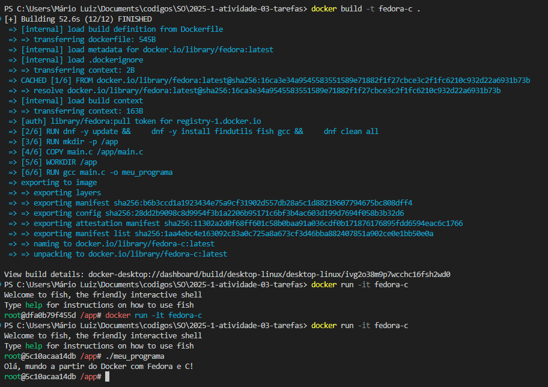

# Relatório da Prática com Docker e Linguagem C

**Nome:** Mário Luiz Silva Guimarães  
**Data:** 12/06/2025

---

## 1. Objetivo

O objetivo desta prática foi configurar um ambiente Docker com Fedora, instalar as ferramentas necessárias para desenvolvimento em C e compilar/rodar um programa simples dentro do container. O exercício ajuda a entender como preparar um ambiente isolado e portátil para desenvolvimento em linguagem C.

---

## 2. Passos Executados

### Comandos e etapas:

```bash
# 1. Criação do arquivo main.c
echo '#include <stdio.h>\n\nint main() {\n    printf("Olá, mundo a partir do Docker com Fedora e C!\\n");\n    return 0;\n}' > main.c

# 2. Dockerfile utilizado:
# (conforme descrito no repositório)

# 3. Build da imagem Docker
docker build -t fedora-c .

# 4. Execução do container com shell fish
docker run -it fedora-c

# 5. Dentro do container, execução do programa:
./meu_programa
````

### Capturas de Tela

> 

---

## 3. Resultados Obtidos

### Saída do programa em C:

```
Olá, mundo a partir do Docker com Fedora e C!
```

### Problemas enfrentados:

* ❌ O GCC não estava disponível inicialmente, foi necessário adicioná-lo ao `Dockerfile`.
* ✅ Solução: adicionado `gcc` à linha de instalação com `dnf`.

---

## 4. Conclusão

A prática foi eficaz para entender como usar Docker como ambiente de desenvolvimento. A integração entre Fedora, GCC e o shell `fish` funcionou bem, e pude executar um programa em C de forma isolada e reproduzível. Esse tipo de ambiente pode ser muito útil para testes rápidos, workshops, e desenvolvimento seguro sem poluir o sistema operacional principal.
